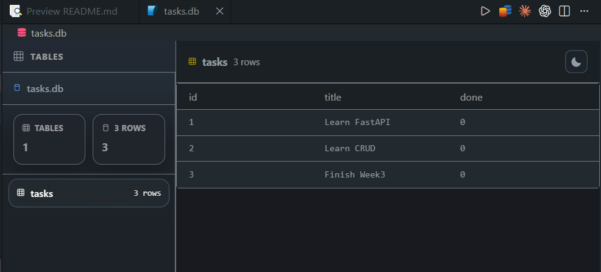

# BE-02 Connecting CRUD to SQLite Database

## Overview

This project is my Week 3 FlyRank Backend AI Engineering assignment.

The goal is to replace an in-memory FastAPI CRUD task API with a persistent SQLite database while keeping the same REST API behavior. Tasks are stored in `tasks.db`, which is created automatically when the application starts.

Core idea:

> The API defines what the application does. The database defines where the application stores data.

## Tech Stack

- Python 3.10+
- FastAPI
- SQLModel
- SQLite
- Uvicorn
- uv

## Project Structure

```text
.
|-- app/
|   |-- database.py
|   `-- models.py
|-- main.py
|-- pyproject.toml
|-- uv.lock
|-- README.md
`-- .gitignore
```

`tasks.db` is generated locally and ignored by Git.

## Database Schema

SQLite database file:

```text
tasks.db
```

Table:

```text
tasks
```

| Column | Type    | Description               |
| ------ | ------- | ------------------------- |
| id     | Integer | Primary key               |
| title  | Text    | Task title                |
| done   | Boolean | Completion status, 0 or 1 |

On startup, the application:

- creates `tasks.db` if missing
- creates the `tasks` table if missing
- seeds three example tasks only when the table is empty

## Installation

Clone the repository:

```bash
git clone https://github.com/Juaaanits/BE-02-connecting-to-database.git
cd BE-02-connecting-to-database
```

Install dependencies with `uv`:

```bash
uv sync
```

## Running The Application

Start the development server:

```bash
uv run uvicorn main:app --reload
```

The API runs at:

```text
http://127.0.0.1:8000
```

Interactive docs:

```text
http://127.0.0.1:8000/docs
```

## API Endpoints

### GET `/tasks`

Returns all tasks from SQLite.

Example response:

```json
[
  {
    "id": 1,
    "title": "Learn FastAPI",
    "done": false
  }
]
```

### GET `/tasks/{task_id}`

Returns one task by ID.

Unknown IDs return:

```json
{
  "error": "Task not found"
}
```

### POST `/tasks`

Creates a new task.

Example request:

```json
{
  "title": "Study SQLite"
}
```

Successful creates return `201 Created`.

Example response:

```json
{
  "id": 4,
  "title": "Study SQLite",
  "done": false
}
```

### PUT `/tasks/{task_id}`

Updates an existing task.

Example request:

```json
{
  "title": "Learn SQLModel",
  "done": true
}
```

### DELETE `/tasks/{task_id}`

Deletes an existing task.

Successful deletes return:

```text
204 No Content
```

## Example cURL Requests

Get all tasks:

```bash
curl http://127.0.0.1:8000/tasks
```

Create a task:

```bash
curl -X POST http://127.0.0.1:8000/tasks \
  -H "Content-Type: application/json" \
  -d "{\"title\":\"Study SQL\"}"
```

Update a task:

```bash
curl -X PUT http://127.0.0.1:8000/tasks/1 \
  -H "Content-Type: application/json" \
  -d "{\"title\":\"Learn SQLModel\",\"done\":true}"
```

Delete a task:

```bash
curl -X DELETE http://127.0.0.1:8000/tasks/1
```

## SQL Practice

I inspected `tasks.db` with a SQLite database viewer and ran SQL queries manually.



List every task:

```sql
SELECT * FROM tasks;
```

Show completed tasks:

```sql
SELECT * FROM tasks WHERE done = 1;
```

Count all tasks:

```sql
SELECT COUNT(*) FROM tasks;
```

During Stage 4, this count query returned:

```text
4
```

Mark every task as completed:

```sql
UPDATE tasks SET done = 1;
```

Delete completed tasks:

```sql
DELETE FROM tasks WHERE done = 1;
```

## Why SQLite

SQLite was chosen because it stores the database in a single local file, requires no separate database server, and is simple to run for a small assignment project. It is a good learning database for understanding tables, rows, primary keys, persistence, and CRUD queries before moving to PostgreSQL or MySQL.

## Learning Outcomes

- Connected FastAPI routes to SQLite using SQLModel.
- Created a database and table automatically on startup.
- Seeded starter rows only when the table is empty.
- Replaced in-memory CRUD storage with persistent database storage.
- Practiced manual SQL queries using a SQLite viewer.
- Preserved the REST API while changing the storage layer.

## Future Improvements

- Add `GET /tasks?search=...` using SQL `LIKE`.
- Add `GET /tasks?done=true` filtering.
- Add sorting with `ORDER BY`.
- Add task statistics with SQL `COUNT`.
- Add timestamps with `created_at` and `updated_at`.
- Add migrations for future schema changes.
